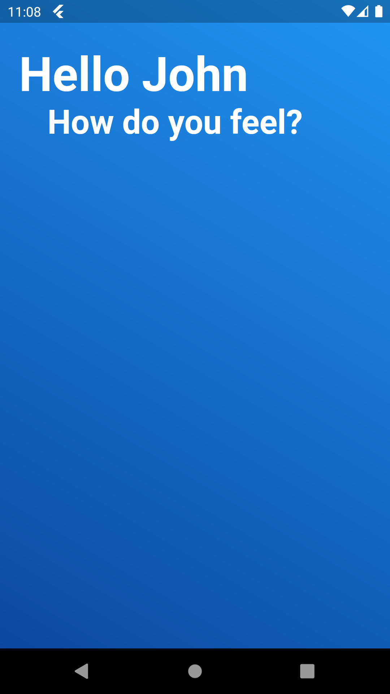
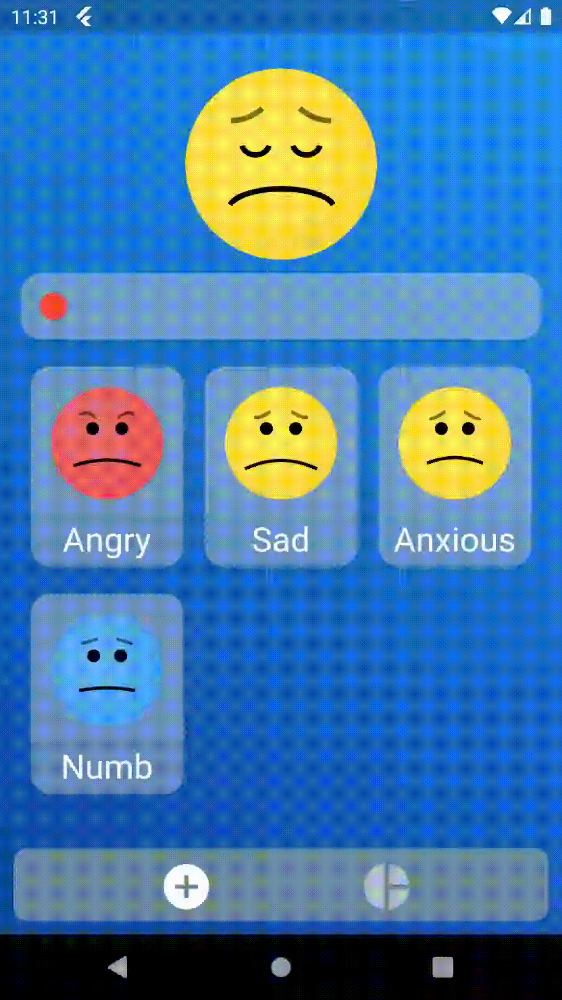
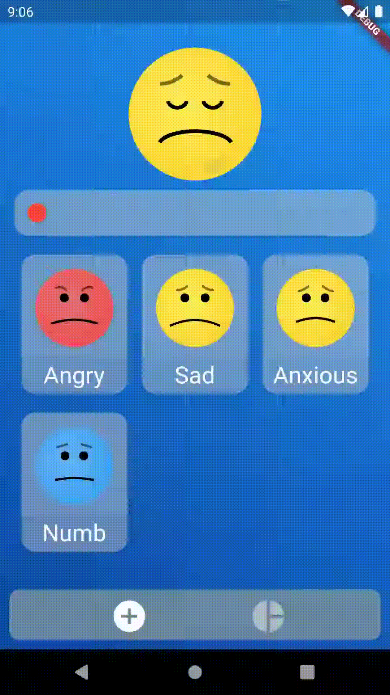

# My Wellbeing
MyWellbeing is designed to be a replacement for the project Healphie.

There is a slider in order to select how you are feeling, which has a face that changes as you drag the slider.

At the bottom selectable emotions appear with a face relating to the text.

There are also animations, for example crying at the lowest level.

